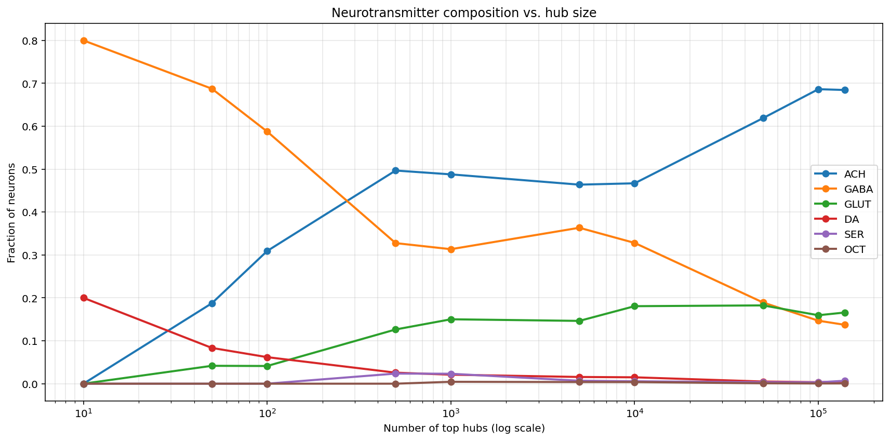
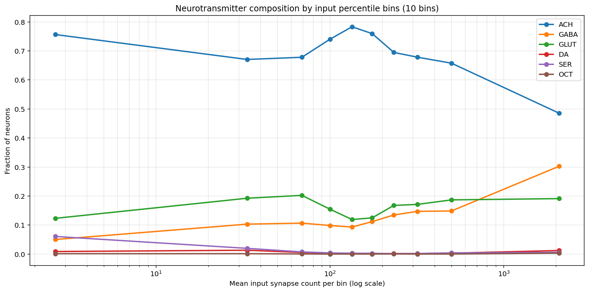
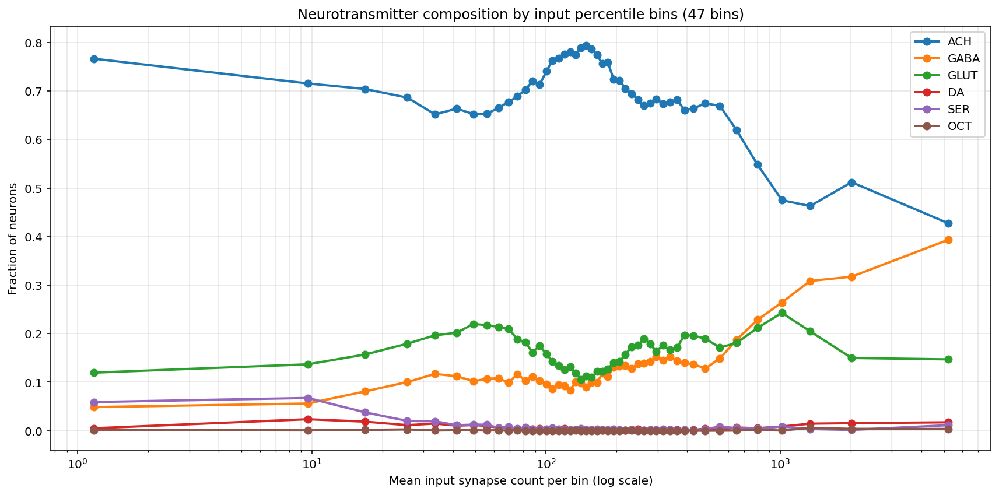
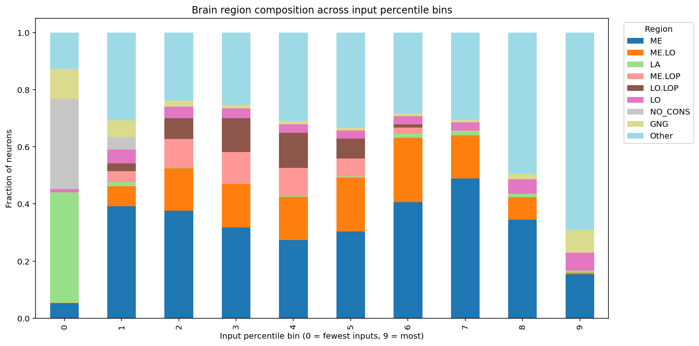
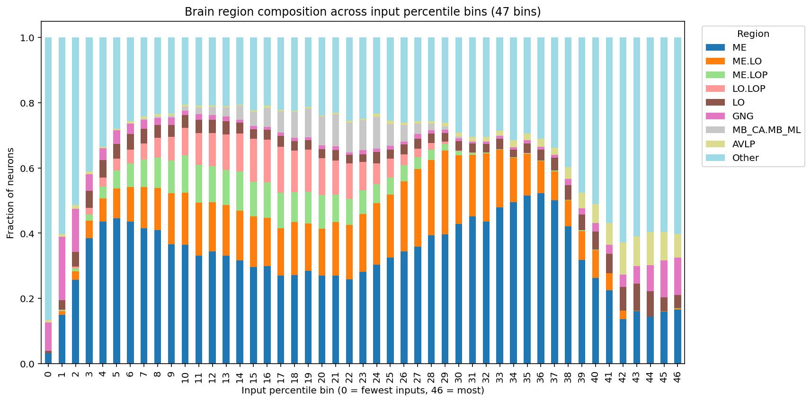

# FlyWire Connectome — Neurotransmitter Composition Analysis

An exploratory analysis of how neurotransmitter identity relates to a neuron's
connectivity in the FlyWire connectome, the first complete wiring diagram of an
adult fruit fly brain [1].

## Background

FlyWire is a whole, neuron-level brain connectome of an adult female
*Drosophila melanogaster*, containing 139,255 neurons and around 50 million synapses [1].
Each neuron has a predicted neurotransmitter (acetylcholine, GABA, glutamate,
dopamine, serotonin, or octopamine) [1].

This project asks a simple question: "does a neuron's neurotransmitter depend on
how connected it is?" In particular, are the brain's biggest "hub" neurons
(those receiving the most synaptic input) chemically different from typical neurons?

A note on interpretation: whether a neurotransmitter excites or inhibits its target
depends on the receptor on the receiving neuron, not just the transmitter itself.
Acetylcholine is generally excitatory in the fly brain, while GABA is inhibitory.
Glutamate is often inhibitory in *Drosophila* (via GluCl receptors), unlike in
vertebrates [2]. The neurotransmitter identities used here are machine-learning
predictions from the connectome dataset [1].

## What the analysis does

1. Computes the total input synapses each neuron receives.
2. Looks at how neurotransmitter composition changes as you focus on the most connected neurons.
3. Splits all neurons into equal-sized groups by input count (percentile bins) to see composition across the whole range, not just the top.
4. Traces an unexpected pattern back to its anatomical source using brain-region annotations.

## Findings

**1. Hub neurons are enriched for inhibitory and modulatory neurotransmitters.**
As you look at more strongly-connected neurons, the fraction using GABA rises
sharply while acetylcholine falls. Among the 10 most-connected neurons, none are
acetylcholine, all are GABA or dopamine. This fits a general principle that major
integrating neurons tend to be inhibitory or modulatory rather than simply
excitatory [2, 3].

**2. Composition tracks the brain's functional hierarchy.
Splitting neurons into input-percentile bins reveals a richer structure than the top-N view. With 10 bins (left), acetylcholine changes roughly monotonically; with 50 bins (right), it resolves into a clear dip-and-peak pattern, showing distinct regimes rather than a single smooth trend.

**3. The mid-range "bump" comes from the visual system.**
The peak in acetylcholine at mid input-counts is driven by optic-lobe neurons
(medulla, lobula, lobula plate), which are numerous and predominantly cholinergic [4].
The low-input bins are dominated by sensory-frontier regions (lamina), and the
high-input bins by central-brain integration centres. So neurochemical composition
follows a sensory → relay → integration gradient across the brain.

*Note on binning:* neurons are split into equal-sized groups by input count using
`pandas.qcut`. Because thousands of neurons share very low input values (≈9,000
have zero inputs), some requested bin edges collapse together, so the actual
number of bins is slightly lower than requested (e.g. requesting 50 yields 47).
This affects only the low-input end; the structure at higher input counts is
unaffected.

## Scripts

**`top_synapse_visualization.py`** — Identifies the 10 neurons receiving the most
synaptic input (the brain's biggest "hubs"), looks up their predicted
neurotransmitters, fetches their 3D shapes from FlyWire, and renders them
in an interactive 3D view coloured by neurotransmitter.

**`nt_graphs.py`** — Analyses neurotransmitter composition across all neurons
as a function of how much input they receive, producing the figures below.

## How to run it
Install dependencies:
pip install pandas matplotlib numpy navis fafbseg plotly

Then run either script:
python top_synapse_visualization.py # interactive 3D view of the top-10 hub neurons
python nt_graphs.py # neurotransmitter composition figures

nt_graphs.py produces the three figures above and prints summary statistics.
top_synapse_visualization.py requires a free FlyWire/CAVE account and API token.

## Data

The connectivity and neurotransmitter tables are not included here due to size.
Download them from the FlyWire Codex:
https://codex.flywire.ai/api/download

- **Connections (Filtered)** → save as `connections_princeton.csv`
- **Neurotransmitter Type Predictions** → save as `neurons.csv`

Place both files in the same folder as the script before running.

## Note

This is an exploratory, self-directed project made while learning connectome
analysis. The findings reproduce known principles of brain organisation rather
than claiming novel results — the goal was hands-on experience with real
connectome data, from raw tables to interpretation.

## References

[1] Dorkenwald, S., et al. (2024). Neuronal wiring diagram of an adult brain.
*Nature*, 634, 124–138.

[2] Lin, A., et al. (2024). Network statistics of the whole-brain connectome of
*Drosophila*. *Nature*, 634, 153–165.

[3] Betzel, R. F., Puxeddu, M. G., & Seguin, C. (2024). Hierarchical communities
in the larval *Drosophila* connectome: Links to cellular annotations and network
topology. *PNAS*, 121(38), e2320177121.

[4] Matsliah, A., Yu, S.-C., et al. (2024). Neuronal parts list and wiring diagram
for a visual system. *Nature*, 634, 166–180.
